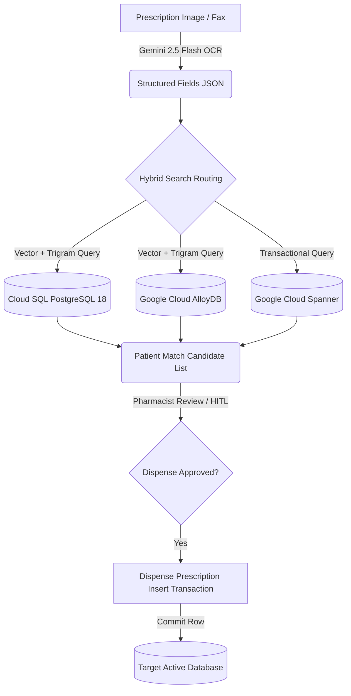

# CloudScript: Pharmacy Intelligence & Automation Platform

CloudScript is a reference implementation of an AI-powered healthcare automation pipeline on Google Cloud. It demonstrates the transition of paper/faxed prescriptions into structured, secure patient records across **Google Cloud Spanner**, **Google Cloud AlloyDB**, and **Cloud SQL PostgreSQL 18** databases.

The system showcases **Multi-Signal Hybrid Matching**: combining HNSW vector cosine embeddings (via Vertex AI text-embeddings and pgvector) with trigram fuzzy string parsing (pg_trgm) to accurately identify patient profiles despite typos, OCR artifacts, or name variations.

---

## 🌟 Core Features & Architecture

1.  **Stage 1: Ingest & OCR Extraction**
    *   Prescriptions arrive as images (fax/upload simulation).
    *   Gemini 2.5 Flash processes the document, extracting key fields (Patient Name, DOB, Insurance ID, Prescriber NPI, Medication, and Refills) in structured JSON format.
2.  **Stage 2: Match & Review (Multi-Signal Query)**
    *   AI search client executes weighted lookups on patient profiles:
        *   **Date of Birth** (35% weight)
        *   **Patient Name** (20% weight: HNSW vector similarity + trigram search score)
        *   **Insurance ID** (20% weight)
        *   **NPI / Fill History** (25% weight)
3.  **Stage 3: Verify & Dispense**
    *   Pharmacist validates the match. On confirmation, the system commits a transactional insert writing the prescription to the chosen target database.
---

## 🗺️ Ingestion Pipeline Architecture



---

## 🖥️ User Interface Preview

### 1. Ingest & Extract Ingest Pipeline
Simulated digital prescription scanner with real-time logging, Gemini extraction status pipeline logs, and extracted field validation cards:


### 2. Live Patient Matching & Review (Verify & Dispense)
Pharmacist interface displaying matches, similarity scoring metrics per patient profile, and secure transactional inserts:


---

## 🛠️ Technology Stack

*   **Frontend**: React + Vite + Tailwind CSS dashboard (located under [cloudscript/frontend](file:///Users/priteshjani/Documents/jetski/cloudscript/frontend))
*   **Backend**: Python FastAPI backend service (located under [cloudscript/backend](file:///Users/priteshjani/Documents/jetski/cloudscript/backend))
*   **Databases Supported**:
    *   *Cloud SQL PostgreSQL 18*: Low-latency relational storage.
    *   *Google Cloud AlloyDB*: High-performance analytical and transaction engine.
    *   *Google Cloud Spanner*: Globally scalable transactional database.
*   **AI Models**: Gemini 2.5 Flash and Vertex AI text-embeddings.

---

## 📂 Directory Layout

```text
jetski/
├── cloudscript/             # Main Application Suite
│   ├── frontend/            # React Client Dashboard (white/soothing layout)
│   └── backend/             # Python FastAPI service, database client router
│       ├── main.py          # FastAPI application server and routers
│       ├── db_client.py     # Unified query router (Spanner, Cloud SQL, AlloyDB)
│       └── requirements.txt # Python requirements
├── skills/                  # Atomic database operations and MCP clients
│   ├── db/                  # Database orchestration and setup scripts
│   │   ├── cloudsql_setup/  # Setup and seed script for Cloud SQL PostgreSQL 18
│   │   ├── alloydb_setup/   # Setup and seed script for AlloyDB Cluster/Database
│   │   └── spanner_setup/   # Setup and seed script for Google Cloud Spanner
├── workflow/                # State machine & DAG orchestrators
│   └── examples/            # Reference workflows
│       ├── pharmacy_prescription_workflow.py # Pharmacy Ingestion Pipeline example
│       ├── db_sync_workflow.py              # Transactional -> Analytical sync
│       └── lakehouse_governance_workflow.py # Dataplex tagging workflow
├── config.example.json      # Configuration parameters template
└── README.md                # This file
```

---

## 🚀 Getting Started

### Prerequisites
*   A **Google Cloud Project** with the following APIs enabled:
    *   *Vertex AI API* (for name and drug embedding similarity)
    *   *Cloud Run API* (for application hosting)
    *   *AlloyDB API* / *Spanner API* / *Cloud SQL Admin API* (depending on your database configuration)
*   Google Cloud Application Default Credentials (ADC) active on your system:
    ```bash
    gcloud auth application-default login
    ```

### 1. Configuration Setup
Create your local configuration file from the template and fill in your GCP project and database credentials:
```bash
cp config.example.json config.json
```

### 2. Database Setup & Seeding
To initialize the schema and populate the demo databases with preset patient scenarios:

*   **Cloud SQL Setup**:
    ```bash
    python3 skills/db/cloudsql_setup/setup_cloudsql.py
    ```
*   **AlloyDB Setup**:
    ```bash
    python3 skills/db/alloydb_setup/setup_alloydb.py
    ```
*   **Spanner Setup**:
    ```bash
    python3 skills/db/spanner_setup/setup_spanner.py
    ```

### 3. Run Local Frontend Development Server
Navigate to the frontend folder, install packages, and launch:
```bash
cd cloudscript/frontend
npm install
npm run dev
```

### 4. Deploy Application to Cloud Run
To package and deploy the containerized application to Google Cloud Run:
```bash
cd cloudscript
gcloud builds submit --tag us-west4-docker.pkg.dev/YOUR_PROJECT_ID/cloudscript-repo/cloudscript:latest
gcloud run deploy cloudscript --image us-west4-docker.pkg.dev/YOUR_PROJECT_ID/cloudscript-repo/cloudscript:latest --platform managed --region us-west4
```
